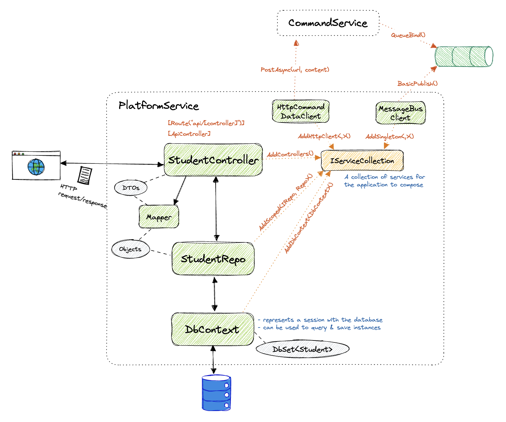

# Start .NET WebApi Project
- `dotnet new webapi -n <project-name>`

## Codebase

### 1. Import packages
- `dotnet add package AutoMapper.Extensions.Microsoft.DependencyInjection`
- `dotnet add package Microsoft.EntityFrameworkCore`
- `dotnet add package Microsoft.EntityFrameworkCore.Design`
- `dotnet add package Microsoft.EntityFrameworkCore.InMemory`
- `dotnet add package Microsoft.EntityFrameworkCore.SqlServer`

### 2. DbContext
- A DbContext instance represents a session with the database and can be used to query and save instances of your entities.
- Create class `AppDbContext` inheriting from `DbContext` and register the given context in `Program.cs`

### 3. Repository
- A repository comprises of an interface for user to interact with the database via `DbContext`.
- `IPlatformRepo` is the interface class defining the available APIs
- `PlatformRepo` is the concrete class defining the logic of interactions with the AppDbContext

### 4. DTOs
- The external representations of our data (vs `Models` which consists of the internal representations)
- Why do we differentiate these two?
    - **Data Privacy**: we do not want clients to know the internal structure of our data
    - **Contractual Coupling**: we might want to change the internal structure of data without disrupting the contract between us and clients

## Docker/Kubernetes

### 1. Dockerize
- Create `Dockerfile`
- Build image: `docker build -t vlinh/beaver-platformservice .`
- Run instance `docker run --name beaver-platformservice -p 8080:80 -d vlinh/beaver-platformservice`

### 2. Kubernetes
- Create `k8s/platforms-depl.yaml`
- Deploy service: 
    - `kubectl apply -f platforms-depl.yaml`
    - `kubectl apply -f commands-depl.yaml`
    - `kubectl apply -f platforms-np-srv.yaml`
- Connect platforms service to commands service using `PlatformService/appsettings.Production.json`

### 3. Nginx Ingress
 - Deploy: https://kubernetes.github.io/ingress-nginx/deploy/ 
 - Create `k8s/ingress-srv.yaml`
 - Associate domain name `beaver.com` to loopback IP address `127.0.0.1` by adding to file `/etc/hosts`: `127.0.0.1 beaver.com`

## SQL Server Database

### 1. PersistentVolumeClaim
- Create `k8s/local-pvc.yaml`

### 2. Secret
- Create secret for MSSQL password: `kubectl apply -f mssql-secret.yaml"`

### 3. Deployment
- Create `k8s/mssql-plat-depl.yaml` 
- Take note that `mcr.microsoft.com/mssql/server:2019-latest` cannot run on M1. The only possible way is to use Azure SQL (https://stackoverflow.com/questions/65398641/docker-connect-sql-server-container-non-zero-code-1)
- We have a LoadBalancer service which enable accessing the database container via `localhost:1433` (can use SSMS or Azure Studio to access)

### 4. Connect PlatformService to MsSql
- Add ConnectionString in `appsettings.Production.json`
- Add migration: `dotnet ef migrations add initialmigration` (trick the app by commenting out certain parts and add them back later)
                       
## RabbitMQ 

### 1. Deployment
- Create `k8s/rabbitmq-depl.yaml`
- RabbitMQ has 2 ports: `5672` for internal communication (clusterip-srv) and `15672` for external management (loadbalancer)

### 2. Asynchronous Service in PlatformService
- Add configs in `appsettings` files
- Create the required classes for interacting with RabbitMQ
    - `PlatformPublishedDto`
    - `MessageBusClient`: publish message to RabbitMQ
    

### 3. Asynchronous Service in CommandService
- Add configs in `appsettings` files
- Create the required classes for interacting with RabbitMQ
    - `PlatformPublishedDto`
    - `GenericEventDto`
    - `MessageBUsSubscriber`: subscribe to queues in RabbitMQ
    - `EventProcessor`: process events 
